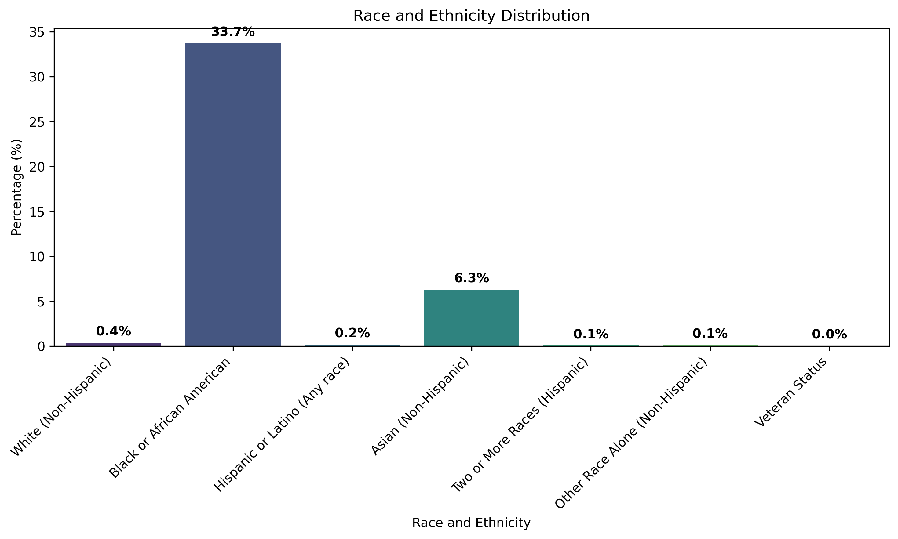
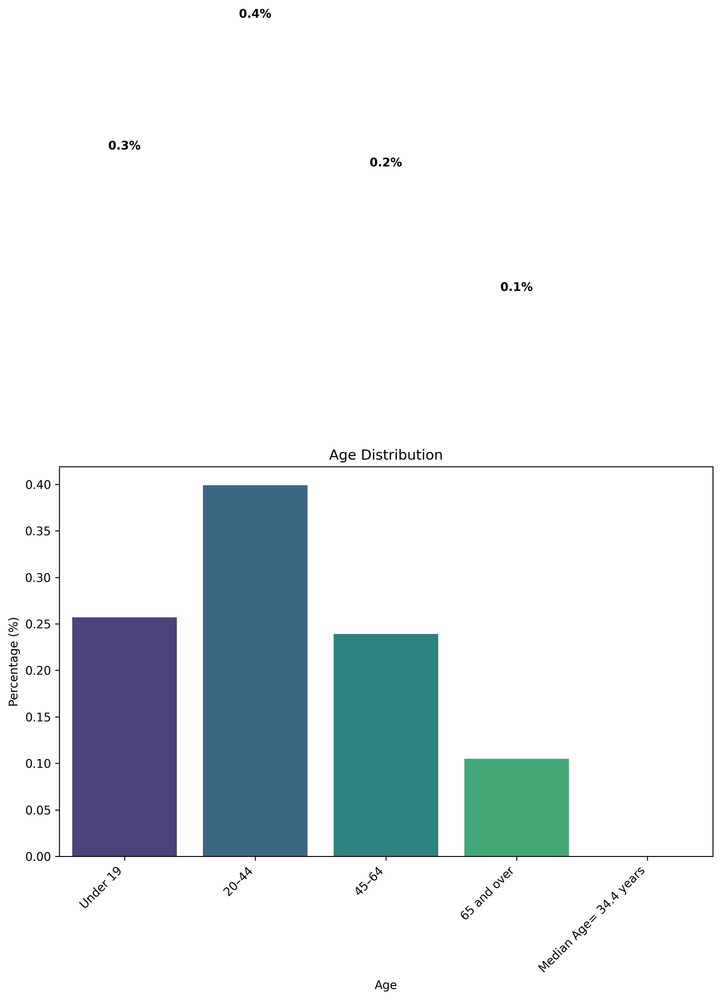
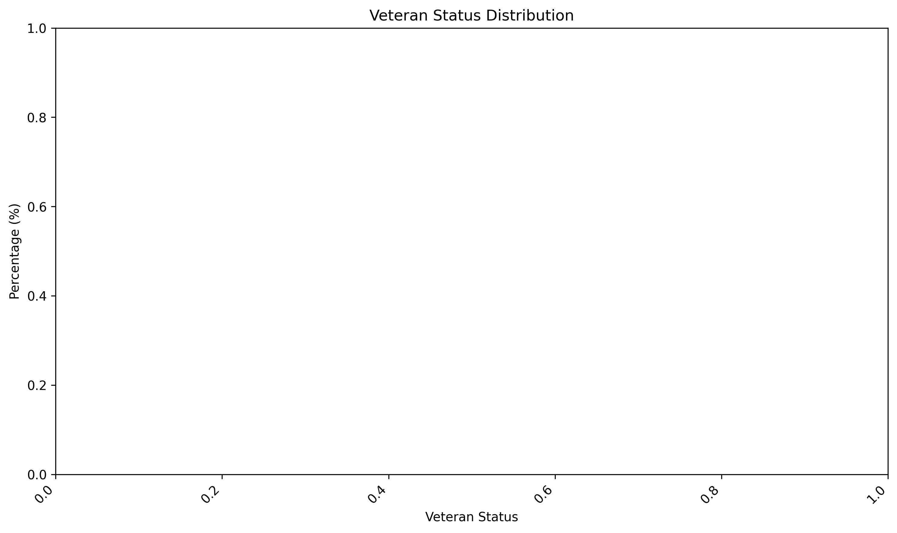
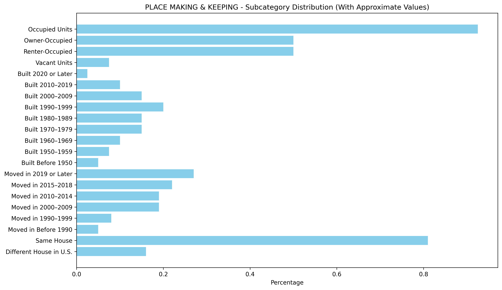

# Figures and Live Maps

## Charts (PNG)
- Demographics: Race and Ethnicity  

- Demographics: Age  

- Demographics: Veteran Status  

- Place Making  

## Live Maps (GitHub Pages)
After enabling GitHub Pages for the repo, use these links:
- https://bhavyasree-19.github.io/Positive-Social-Impact-Tool-PSIT-Charlotte-Neighborhood-Analysis/figures/parks_map.html
- https://bhavyasree-19.github.io/Positive-Social-Impact-Tool-PSIT-Charlotte-Neighborhood-Analysis/figures/recreation_map.html
- https://bhavyasree-19.github.io/Positive-Social-Impact-Tool-PSIT-Charlotte-Neighborhood-Analysis/figures/transportation_map.html
- https://bhavyasree-19.github.io/Positive-Social-Impact-Tool-PSIT-Charlotte-Neighborhood-Analysis/figures/education_libraries_map.html
- https://bhavyasree-19.github.io/Positive-Social-Impact-Tool-PSIT-Charlotte-Neighborhood-Analysis/figures/wellness_safety_map.html
- https://bhavyasree-19.github.io/Positive-Social-Impact-Tool-PSIT-Charlotte-Neighborhood-Analysis/figures/healthcare_psit_map.html
- https://bhavyasree-19.github.io/Positive-Social-Impact-Tool-PSIT-Charlotte-Neighborhood-Analysis/figures/finance_map.html
- https://bhavyasree-19.github.io/Positive-Social-Impact-Tool-PSIT-Charlotte-Neighborhood-Analysis/figures/land_map.html
